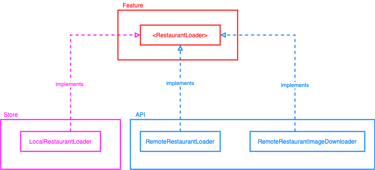
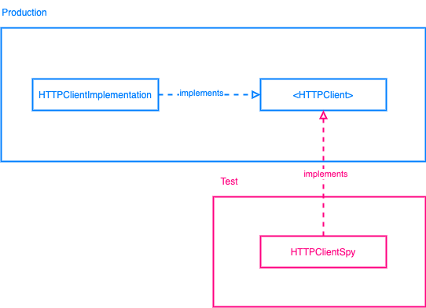

# MultiThreadingAndPolymorphism

RestaurantApp simulates behind the scene of getting data from database or local storage (cache). In this app, we learn how polymorphism can facilitate us to write automated test. And we also learn how to simulate download proses in different thread.

### Polymorphism
`RestaurantLoader` dependency diagram:



`HTTPClient` dependency diagram:



### Multithreading
```
runnable = () -> {
    System.out.println("Downloading...");
    imageDownloader.load();

    try {
        Thread.sleep(10000);
        System.out.println("Downloaded");
    } catch (Exception e) {
        System.err.println(e);
    }
};
```
